# TypeScript Tips and Tricks
### _by Szymon Standarski 2020_

## 001 Optional Chaining 
__TS 3.7__

note: _Każdy z nas spotkał się z taką sytuacją:_
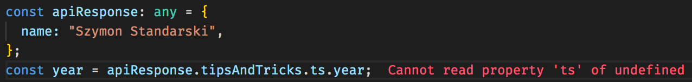

Spotykane rozwiązania:
* if za if'em :) 
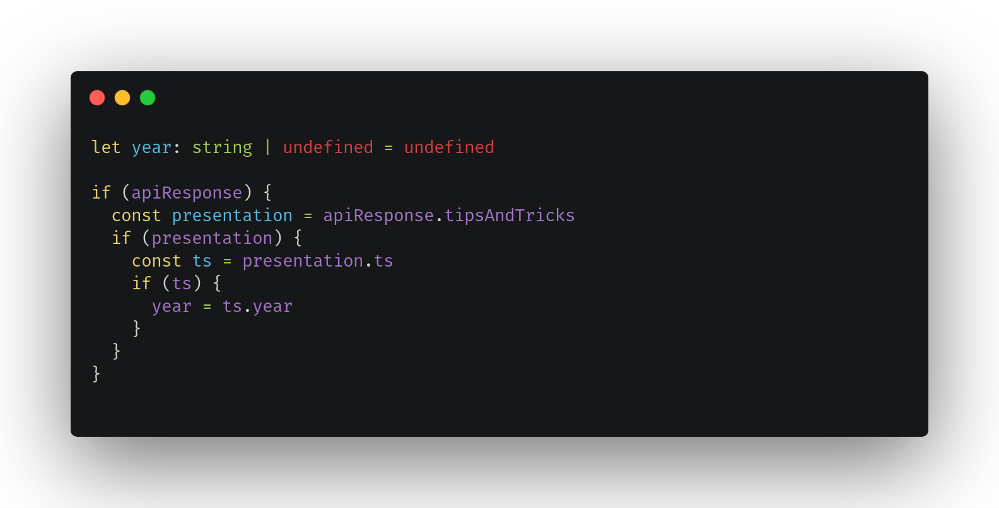
* "nowoczesna" wersja if za if'em :)

* logic expression
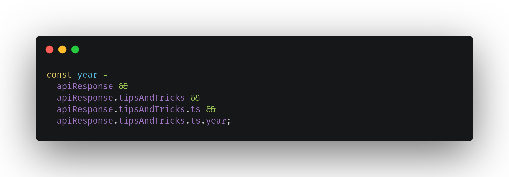
* Try/catch
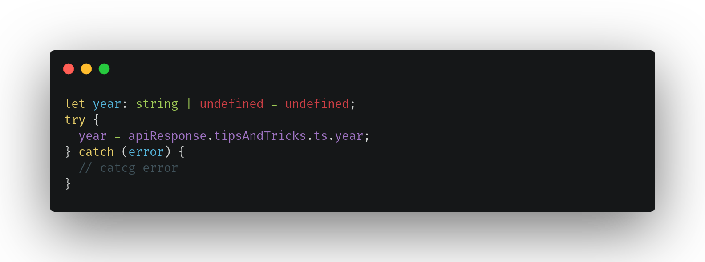
* Lodash
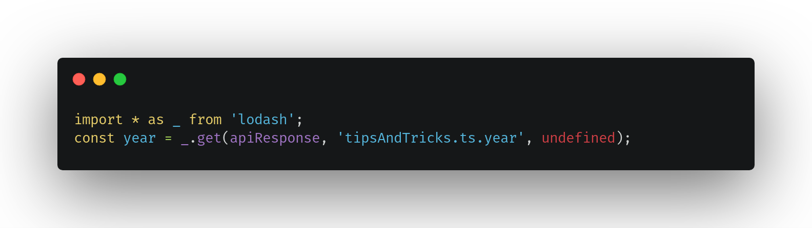

#### I tutaj wchodzi cały na biało "The Optional Chaining Operator"
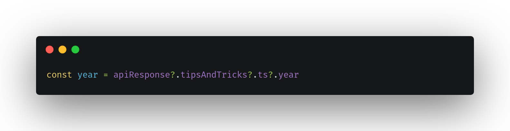

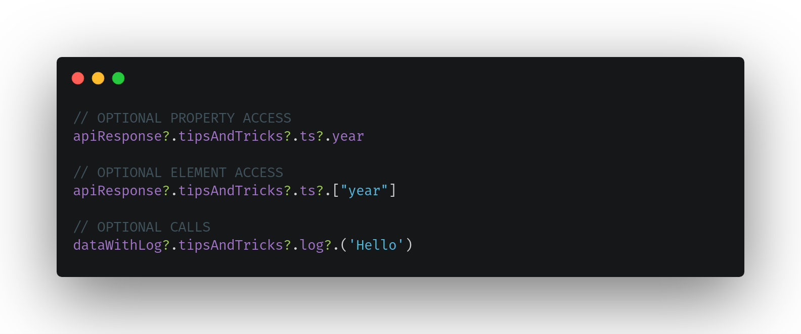

## 002 The nullish coalescing operator (??)
#### JS & TS
_The nullish coalescing operator_ jest operatorem logiczny który zwraca prawy operator wtedy gdy lewy jest `null` lub `undefined`. Jest to nowość z najnoweszego ECS więc od razu automatycznie występuje w TS.

Podstawowa różnica pomiędzy `||` a `??` jest taka że operator `||` w przypadku gdy wartość po lewej stronie będzie `= false` zwróci prawą stronę przez co w wielu przypadkach może nie być dobrym rozwiązaniem np. `0` `''`

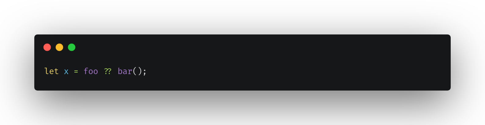

## 003 Partial
_Jeśli potrzebujecie aby część parametrów była opcjonalna możecie użyć operatora `Partial<Type>`. Dzięki temu nie trzeba dodwać w istniejącym typie znaków zapytania, albo tworzyć nowy typ_

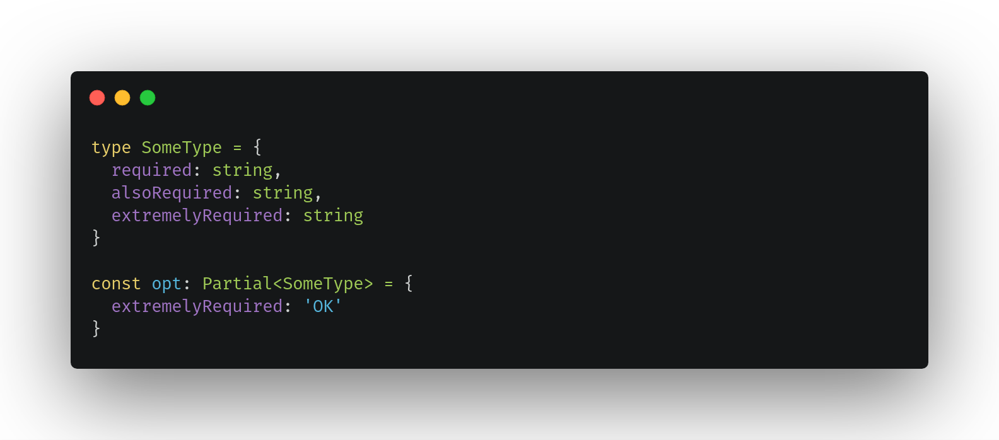

## 004 Rodzina :)
_Szybka ciekawostka_
_Screen z konsoli chrome'a_

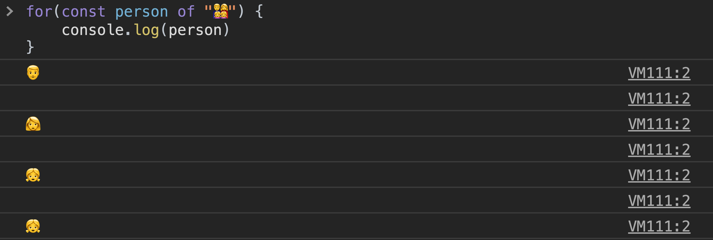
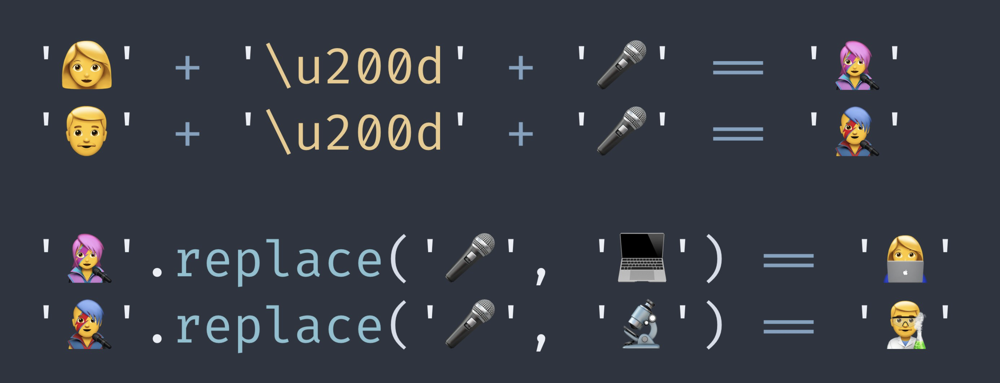

## 005 Warunkowe filtrowanie w TS

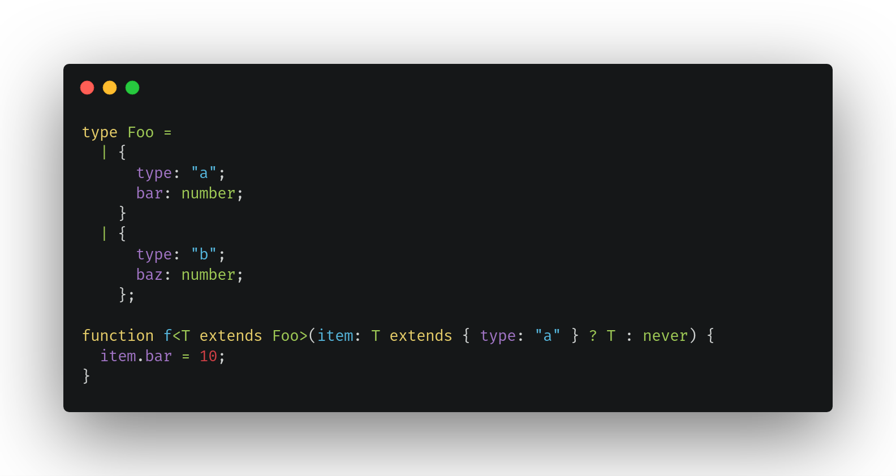

## 006 wybieranie parametrów na podstawie typu

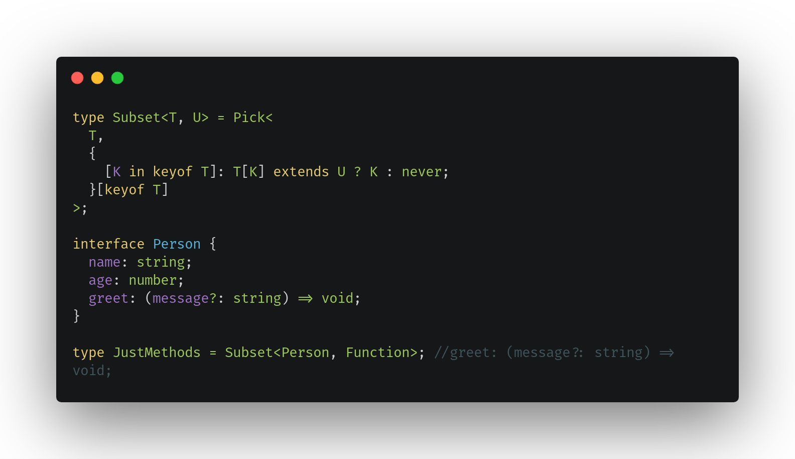

## post-fix expression operator

console.log(textEl!.value); 
// 👍 with "!" we assure TypeScript
// that 'textEl' is not null/undefined

