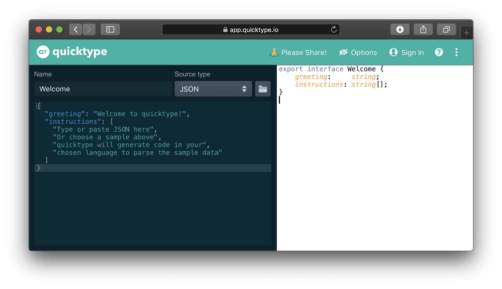

# Utils Tips and Tricks
### _by Szymon Standarski 2020_

## Interfejs na podstawie danych z API
### utils
Jesli często się wam zdaża budować `Interface` na podstawie danych z api - warto użyć do tego zewnętrznych narzędzi które przekonwertują nam JSON'a na porządaną strukturę: 

Wtyczka do VS CODE -> https://marketplace.visualstudio.com/items?itemName=typeguard.quicktype-vs
Dodać animacje jak tego używam!

https://app.quicktype.io
